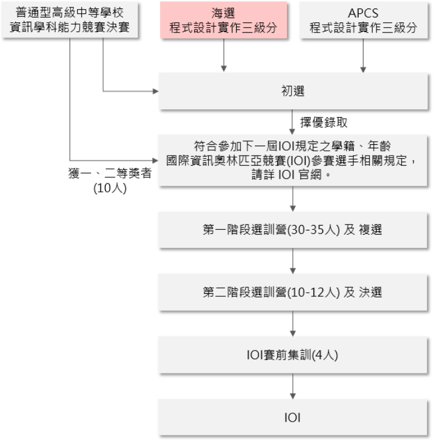

# Awesome High School Competition

* [演算法](#演算法)
   * [APCS](#apcs)
   * [邁向 IOI 系列](#邁向-ioi-系列)
   * [TOI 線上練習賽](#toi-線上練習賽)
   * [ITSA 線上程式設計競賽](#itsa-線上程式設計競賽)
   * [NPSC 網際網路程式設計全國大賽](#npsc-網際網路程式設計全國大賽)
* [資訊安全](#資訊安全)
   * [MyFirstCTF](#myfirstctf)
   * [AIS3 新型態資安實務主題課程](#ais3-新型態資安實務主題課程)
   * [AIS3 EOF CTF](#ais3-eof-ctf)
   * [資安系列競賽 - 資安技能金盾獎競賽](#資安系列競賽-資安技能金盾獎競賽)
* [資訊相關](#資訊相關)
   * [Bebras 國際運算思維挑戰賽](#bebras-國際運算思維挑戰賽)
   * [資訊月資訊應用技能競賽](#資訊月資訊應用技能競賽)

## 演算法

### APCS

APCS 為 Advanced Placement Computer Science 的英文縮寫，是指「大學程式設計先修檢測」。其檢測模式乃參考美國大學先修課程（Advanced Placement，AP），與各大學合作命題，並確定檢定用題目經過信效度考驗，以確保檢定結果之公信力。

https://apcs.csie.ntnu.edu.tw/

### 邁向 IOI 系列

1. 校內賽 (參考學校公告)
2. 分區賽 (各區競賽選拔)

**[資訊學科能力競賽決賽模擬賽](https://nhspc.cc/)**

3. [資訊學科能力競賽決賽](http://nhspc.csie.ntnu.edu.tw/)
4. [TOI 台灣國際資訊奧林匹亞](https://toi.csie.ntnu.edu.tw/)
5. [IOI 國際資訊奧林匹亞競賽](https://zh.wikipedia.org/zh-tw/國際資訊奧林匹亞競賽)

### TOI 線上練習賽

**新手組**

上下學期各三場 :

- 3月 / 10月：輸出入、選擇、迴圈
- 4月 / 11月：一維陣列、搜尋
- 5月 / 12月：多維陣列、字串

**潛力組**

以下範圍為主 :

-  排序、貪心
-  堆疊、佇列、樹
-  DFS、BFS、D&C
-  基礎 DP

https://toi-reg.csie.ntnu.edu.tw/

### ITSA 線上程式設計競賽

ITSA 線上程式設計競賽原則上於每兩個月一次，以透過網路的方式進行。ITSA每隊一人，全國學生皆可參賽。詳細比賽日期時間與辦法可參見訊息發布網頁: https://sites.google.com/site/itsancku/home 或臉書粉絲頁: https://www.facebook.com/itsancku?fref=nf

https://sites.google.com/site/itsancku/

### NPSC 網際網路程式設計全國大賽

- 初賽於預定之時間上網參賽，並須報名之隊數超過 25 隊才舉行。
- 決賽於臺灣大學計算機及資訊網路中心舉辦。
- 高中組：取前 25 名之隊伍晉級決賽，每校至多 3 隊晉級；得另外邀請 3 隊全女子隊伍參加決賽(至少須答對一題以上含一題)。
- 國中組：取前 25 名之隊伍晉級決賽，每校至多 5 隊晉級；得另外邀請 3 隊全女子隊伍參加決賽(至少須答對一題以上含一題)。

※ 註：自學者每組最多錄取 3 隊進決賽，主辦單位保留錄取權利。

https://contest.cc.ntu.edu.tw/

## 資訊安全

### MyFirstCTF

對資安競賽有興趣且未曾錄取參加過本計畫主辦之 AIS3 新型態資安暑期課程、AIS3 EOF CTF 競賽(決賽)、MyFirstCTF 競賽、以及國際資安競賽決賽等賽事的本國籍在校生。

https://ais3.org/mfctf/

### AIS3 新型態資安實務主題課程

邀請具資安實務與國際資安競賽實戰經驗之國內外專家學者進行授課，透過資訊安全實務(或實戰)之經驗分享與演練，提升本課程學員之資安實務的能力與深度。

https://ais3.org/

### AIS3 EOF CTF

AIS3 EOF 資安搶旗競賽透過邀請各領域資安專家協助建立高水準的資訊安全實戰演練平台，並期能透過競賽的方式提供 AIS3 學員與國內資安學子相互切磋資安實務能力的機會。

https://ais3.org/eof/

### 資安系列競賽 - 資安技能金盾獎競賽

為加強學生資通安全認知與技術能力，特舉辦「資安技能金盾奬」競賽活動，透過理論知識與技術實作競技，提升大專校院與國高中學生資安技術教育水準。

https://csc.nccst.nat.gov.tw/shield.aspx/

## 資訊相關

### Bebras 國際運算思維挑戰賽

國際運算思維挑戰賽 (International Challenge on Informatics and Computational Thinking，簡稱 Bebras Challenge) 自 2004 年開始每年於 11 月中的國際 Bebras 週 (World-Wide Bebras Week) 全球同步舉行。Bebras Challenge 藉由淺顯易懂又生活化的情境式題型，讓參與學生運用抽象化、演算法設計、問題拆解、模式辨識、樣式一般化、自動化…等運算思維 (Computational Thinking) 核心能力，自我挑戰解決問題。Bebras Challenge 除了可以讓任課教師了解學生的運算思維知能以及學生是否具備學習資訊科學之性向外，亦能激起學生對資訊科學之學習興趣。

http://bebras.csie.ntnu.edu.tw/

### 資訊月資訊應用技能競賽

| 項次 | 競賽組別                                 | 證照                                                                                              |
|:---- |:---------------------------------------- |:------------------------------------------------------------------------------------------------- |
| 1    | Python 程式語言組 (Python 3)             | 不需證照                                                                                          |
| 2    | 創意 App 程式設計組 (App Inventor 2)     | 不需證照                                                                                          |
| 3    | 視傳設計技術應用組 (Illustrator CC 22.1) | 不需證照                                                                                          |
| 4    | 商業數據分析組 (Excel 2016)              | 不需證照                                                                                          |
| 5    | 商用專業編輯組 (Word2016)                | 需證照，TQC 文書處理或商務軟體應用能力 Word 2007/2010/2013/2016 Microsoft Office 2016/2019        |
| 6    | 商用簡報技巧組 (Power Point2016)         | 需證照，TQC 電腦簡報或商務軟體應用能力 Power Point 2007/2010/2013/2016 Microsoft Office 2016/2019 |
| 7    | 會計資訊與財務分析組 (IFRS 第二版)       | 需證照，TQC 電腦會計/電腦會計 IFRS                                                                |

https://www.infomonth.com/index.aspx/
